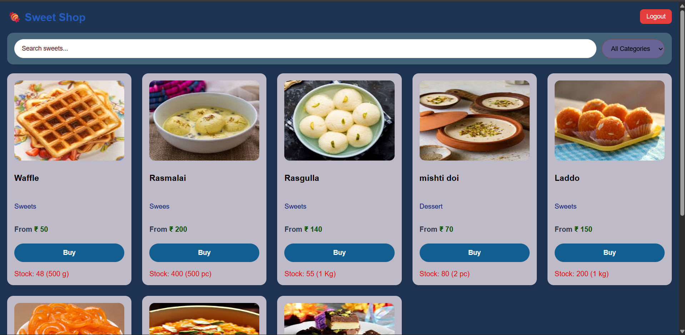
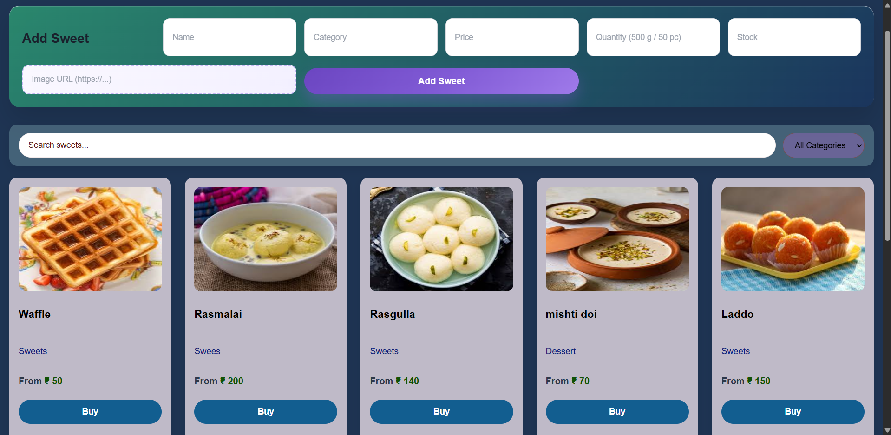
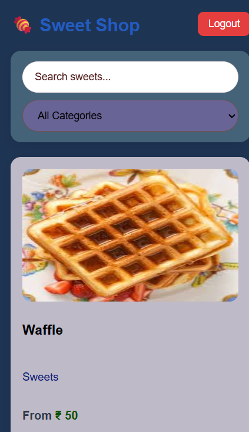

🍬 Sweet Shop Management System

A full-stack Sweet Shop Management System built with FastAPI (Backend) and React (Frontend).
The application supports user authentication, role-based access control (Admin/User), sweet inventory management, and purchase functionality, following Test-Driven Development (TDD) principles.

✨ Features
👤 User Features

User registration & login

View available sweets

Search & filter sweets by name and category

View price, quantity unit (g/kg/pcs), and stock

Buy sweets (reduces stock automatically)

Mobile-responsive UI

🛠 Admin Features

Add new sweets

Update existing sweets

Delete sweets

Restock sweets

Add product image via URL

Admin access strictly controlled from backend

🔐 Security

JWT-based authentication

Protected routes using FastAPI dependencies

Role-based authorization (Admin/User)

🧪 Test-Driven Development (TDD)

This project follows Red → Green → Refactor TDD workflow.

✔ Test Coverage

User registration

User login

Authorization checks

Fetch sweets

Purchase sweets (stock validation)

▶ Run Tests
pytest -v

📊 Latest Test Result
3 passed, 1 warning in 0.22s

🖼 Screenshots

🔐 Login Page

👤 User View

🛠 Admin Dashboard

📱 Mobile View

🧩 Tech Stack
Frontend

React (Vite)

Axios

CSS (Custom responsive UI)

Backend

FastAPI

SQLAlchemy

SQLite

Python-JOSE (JWT)

Uvicorn

Testing

Pytest

Deployment

Frontend: Netlify / Vercel

Backend: Render / Vercel

📁 Project Structure
sweet-shop-management-system/
│
├── screenshots/
│   ├── login.png
│   ├── user.png
│   ├── admin.png
│   └── phone.png
│
├── sweetshop-frontend/
│   ├── src/
│   ├── public/
│   └── package.json
│
├── tests/
│   ├── conftest.py
│   ├── test_auth.py
│   └── test_sweets.py
│
├── auth.py
├── database.py
├── models.py
├── sweets.py
├── main.py
├── requirements.txt
└── README.md

⚙️ Setup Instructions
Backend
python -m venv venv
source venv/bin/activate
pip install -r requirements.txt
uvicorn main:app --reload

Frontend
cd sweetshop-frontend
npm install
npm run dev

🤖 My AI Usage
AI Tools Used

ChatGPT (OpenAI)

Gemini

How I Used AI

Generated initial boilerplate for FastAPI routes

Helped design JWT authentication logic

Assisted in writing Pytest test cases

Helped debug CORS, deployment, and frontend issues

Suggested UI improvements and responsive layouts

Helped refactor code following TDD best practices

Reflection

Using AI significantly accelerated development, especially during:

Debugging complex backend/frontend integration

Writing and fixing tests

Improving UI/UX consistency

However, all logic decisions, architecture, and final implementations were manually reviewed, customized, and validated to ensure correctness and learning value.

🧑‍💻 Author

Suman Kumar
Computer Science Engineering
Chandigarh University
